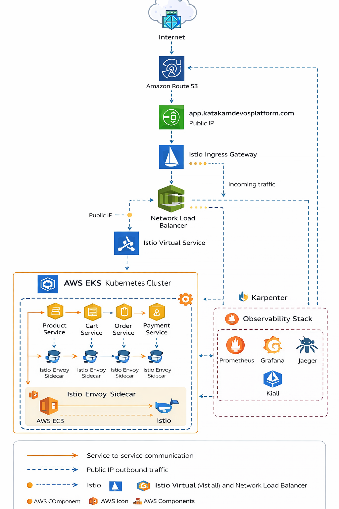
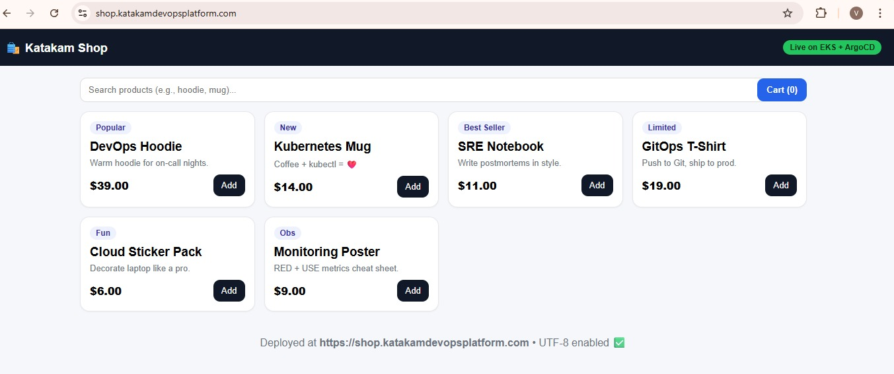
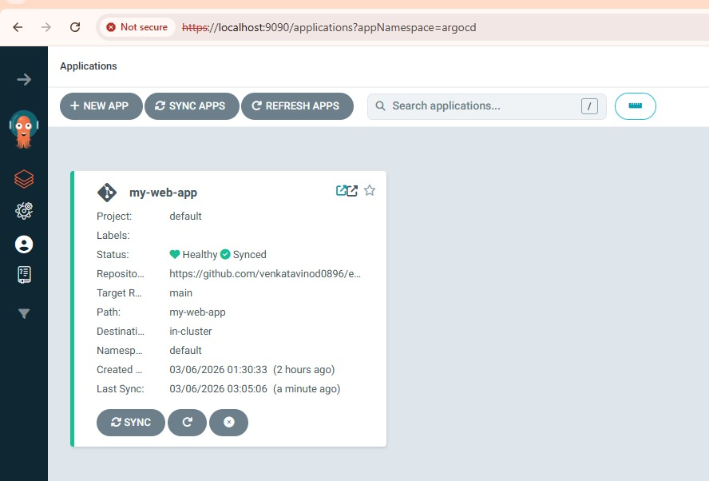
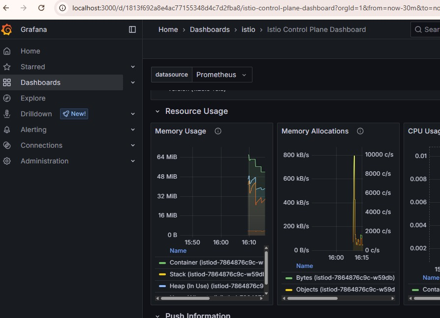

# 🚀 AWS EKS GitOps Microservices Platform


A **production-style cloud-native microservices platform** built using:

AWS EKS • Istio Service Mesh • ArgoCD GitOps • Terraform • Prometheus • Grafana • Jaeger • Kiali

This project demonstrates how to design and operate a **fully observable Kubernetes platform with GitOps deployment and service mesh traffic management**.

---

# 🌐 Live Demo

```
https://shop.katakamdevopsplatform.com
```

---

# 🏗 Architecture Diagram



---

# 🔄 End-to-End Request Flow

```
User Browser
      ↓
Route53 DNS
      ↓
AWS Network Load Balancer
      ↓
Istio Ingress Gateway
      ↓
Istio VirtualService Routing
      ↓
Kubernetes Services
      ↓
Microservices Pods
      ↓
Envoy Sidecar Proxies
      ↓
Observability Stack
```

---

# 🧱 Platform Architecture Layers

### Layer 1 — Infrastructure

```
Terraform
AWS VPC
AWS EKS
AWS Load Balancer
Route53 DNS
```

### Layer 2 — Platform

```
Kubernetes (EKS)
Istio Service Mesh
ArgoCD GitOps
```

### Layer 3 — Application

```
product-service
cart-service
order-service
payment-service
user-service
```

### Layer 4 — Observability

```
Prometheus
Grafana
Jaeger
Kiali
```

### Layer 5 — User Access

```
Route53 DNS
AWS Network Load Balancer
Istio Ingress Gateway
```

---

# 🛒 Application UI



Microservices implemented:

```
product-service
cart-service
order-service
payment-service
user-service
```

Each service runs inside **Kubernetes pods with Istio Envoy sidecar proxy** enabling service mesh features.

---

# 🚀 GitOps Deployment (ArgoCD)



Deployment workflow:

```
Developer
   ↓
GitHub Repository
   ↓
ArgoCD detects changes
   ↓
Automatic Sync
   ↓
Deploy to EKS Cluster
```

Benefits:

* automated deployments
* version-controlled infrastructure
* easy rollback
* continuous delivery

---

# 🌐 Service Mesh Visualization (Kiali)


Kiali visualizes service-to-service communication inside the service mesh.

Example service flow:

```
product-service
      ↓
cart-service
      ↓
order-service
      ↓
payment-service
```

Capabilities:

* traffic visualization
* service dependency graphs
* request rate monitoring
* error rate monitoring

---

# 📊 Monitoring with Grafana



Metrics visualized:

* CPU usage
* memory usage
* request latency
* service throughput

Dashboard used:

```
Istio Control Plane Dashboard
```

---

# 📈 Metrics Collection with Prometheus


Example targets:

```
istio-ingressgateway
product-service
order-service
jaeger
```

Prometheus collects metrics from:

* Kubernetes pods
* Istio ingress gateway
* cluster components

---

# 🔎 Distributed Tracing with Jaeger


Trace example:

```
User Request
      ↓
product-service
      ↓
cart-service
      ↓
order-service
      ↓
payment-service
```

Benefits:

* latency analysis
* request tracing
* debugging distributed systems

---

# 🚀 Advanced Istio Features Implemented

## Canary Deployment

Traffic split example:

```
product-service v1 → 90%
product-service v2 → 10%
```

Benefits:

* gradual rollout
* safer deployments
* quick rollback

---

## Retry & Timeout Policies

Example:

```
retries:
  attempts: 3
  perTryTimeout: 2s

timeout: 5s
```

Benefits:

* automatic retry on failure
* improved reliability

---

## Fault Injection Testing

Tested scenarios:

* artificial delays
* service failures
* network latency simulation

Purpose:

* validate system resilience
* test monitoring alerts

---

# ⚠ Issues Faced During Implementation

### DNS returning 404

Fix: Update Route53 record to Istio LoadBalancer.

---

### 502 Bad Gateway

Fix: Correct Istio VirtualService routing rules.

---

### Istio sidecar not injected

Fix:

```
kubectl label namespace ecommerce istio-injection=enabled
```

---

### ArgoCD OutOfSync

Fix: Correct repository path configuration.

---

# 🚨 Real Production Incident Scenarios & Fixes

### Application Down

Check:

```
kubectl get pods
kubectl get svc
kubectl get gateway
kubectl get virtualservice
```

---

### Service Communication Failure

Check:

```
kubectl get endpoints
kubectl get svc
```

Use **Kiali service graph**.

---

### High Latency

Use observability tools:

```
Jaeger
Grafana
Prometheus
```

---

### Pod CrashLoopBackOff

Check:

```
kubectl logs
kubectl describe pod
```

---

### Prometheus Targets DOWN

Fix metrics annotations:

```
prometheus.io/scrape: "true"
prometheus.io/port: "8080"
```

---

# 🎯 Scenario-Based Interview Questions

### Scenario 1 — Application not accessible

Check:

```
DNS
Load Balancer
Ingress Gateway
Services
Pods
```

---

### Scenario 2 — Traffic spike

Solutions:

```
Horizontal Pod Autoscaler
Karpenter node autoscaling
```

---

### Scenario 3 — Deployment failure

```
kubectl logs
kubectl describe pod
argocd app get <app>
```

---

# 🎤 Interview Explanation Scripts

## 30-Second Explanation

This project demonstrates a microservices platform on AWS EKS using Istio service mesh and GitOps deployment with ArgoCD. Traffic flows through Route53 and AWS Load Balancer into Istio Ingress Gateway and then to microservices. Observability is implemented with Prometheus, Grafana, Jaeger, and Kiali.

---

## 2-Minute Explanation

The platform hosts a microservices-based e-commerce application deployed on AWS EKS. Traffic enters through Route53 and AWS Network Load Balancer and reaches the Istio Ingress Gateway. Istio manages routing between microservices. Observability is implemented using Prometheus, Grafana, Jaeger, and Kiali. ArgoCD ensures GitOps-based continuous delivery.

---

## 5-Minute Explanation

Infrastructure is provisioned with Terraform. The application runs on EKS with Istio service mesh managing service communication. ArgoCD implements GitOps deployment from GitHub. Prometheus collects metrics, Grafana visualizes dashboards, Jaeger traces distributed requests, and Kiali shows service topology.

---

# ✅ Production Readiness Checklist

| Capability               | Status |
| ------------------------ | ------ |
| Infrastructure as Code   | ✅      |
| Kubernetes Orchestration | ✅      |
| Service Mesh             | ✅      |
| GitOps Deployment        | ✅      |
| Observability Stack      | ✅      |
| Traffic Management       | ✅      |
| Canary Deployment        | ✅      |
| Fault Injection Testing  | ✅      |
| Monitoring & Metrics     | ✅      |
| Distributed Tracing      | ✅      |
| Autoscaling              | ✅      |

---

# 🛠 Technology Stack

| Component      | Tool       |
| -------------- | ---------- |
| Cloud          | AWS        |
| Kubernetes     | EKS        |
| Service Mesh   | Istio      |
| GitOps         | ArgoCD     |
| Monitoring     | Prometheus |
| Dashboards     | Grafana    |
| Tracing        | Jaeger     |
| Visualization  | Kiali      |
| Infrastructure | Terraform  |

---

# 🔮 Future Improvements

Possible enhancements:

* Strict mTLS enforcement
* Blue-Green deployments
* Chaos engineering experiments
* advanced CI/CD automation
* security scanning pipelines

---

# 👨‍💻 Author

**Venkata Vinod Kumar Katakam**

DevOps Engineer | Cloud | Kubernetes | Platform Engineering

GitHub:

```
https://github.com/venkatavinod0896
```
